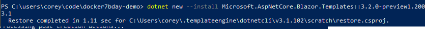
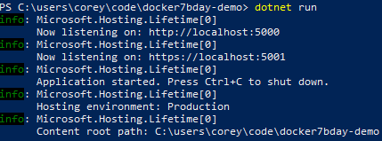
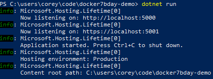
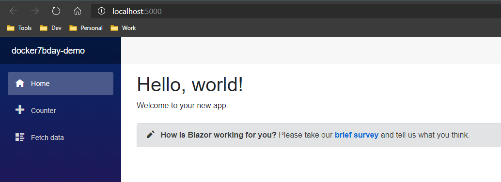
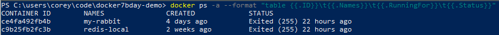
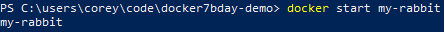
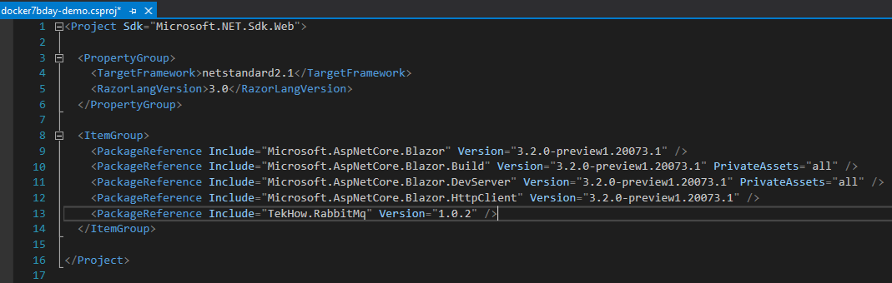
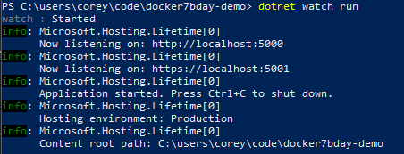
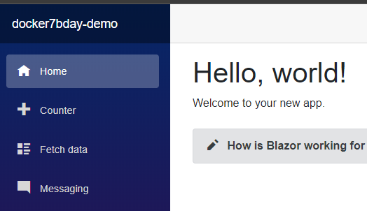

# Docker 7th Birthday Demo (Blazor + RabbitMQ on Docker)

## Install Docker

> Windows

* [Docker for Windows](https://docs.docker.com/docker-for-windows/install/)

> Linux

* [Docker for Linux](https://docs.docker.com/install/linux/docker-ce/ubuntu/)

> Mac

* [Docker for Mac](https://docs.docker.com/docker-for-mac/install/)

## Install VS 2019

> Windows & Mac

* [Visual Studio Downloads](https://visualstudio.microsoft.com/downloads/)

> Linux

* Download Visual Studio Code (same link as above)
  * (some extra configuration might be necessarry for a full debugging experience - Google & StackOverflow are your friends)
* Download the .NetCore 3.1.x SDK if it is not included in your VS 2019 install.
* You can verify what .NetCore versions are installed via this command from your command prompt or terminal _dotnet --list-sdks_

## Install RabbitMq Docker

> [More info](https://www.rabbitmq.com/)
> RabbitMQ is lightweight and easy to deploy on premises and in the cloud. It supports multiple messaging protocols. RabbitMQ can be deployed in distributed and federated configurations to meet high-scale, high-availability requirements.
> We will be using rabbitMq in our demo as a messaging server and client.

* Pull the rabbitMq container that includes management plugin container image
  * Use this command to pull the container _[rabbitmq:3-management](https://hub.docker.com/_/rabbitmq)_ by executing _docker pull rabbitmq:3-management_
  * Run the container with the following command _docker run --name my-rabbit --hostname my-rabbit -p 8080:15672 -d rabbitmq:3-management_ which indicates to run this container using the specifed host name and map the host port 8080 to the container rabbitMq port 15672.
  * _-d_ Indicates to run the container in detached mode which means we started the container and returned to the host command prompt.
  * If you browse to [http://localhost:8080](http://localhost:8080) you should see the RabbitMq managment page. The default user name is _guest_ and the password is _guest_.

  * Congrats you have successfuly deployed the RabbitMq docker container.

## Create Sample App

* Create a folder to store your application and Dockfile with in _ex. C:\code\blazor-doker-demo\)_

* From the command line or terminal run the following commands in the above created folder that will contain your project and Dockerfile _ex. (C:\code\blazor-docker-demo\\)_.
* You may open PowerShell or any command line terminal _I will be using PowerShell for this tutorial._
* Then execute the command _dotnet new_ to view a list of the installed templates.

* Next execute _dotnet new --update-check_ to check for template updates and run the command it provides if updates are available.

* Scroll through the list to see if you find the template named "blazorwasm". If you don't find the _blazorwasm_ template installed run the following command to install the Blazor templates  _dotnet new -i Microsoft.AspNetCore.Blazor.Templates::3.2.0-preview1.20073.1_
* Execute _dotnet new_ again to see a list of installed template and verify the blazor template is now instaled.
* Type _dotnet new blazorwasm_ in the project folder your created and you should see the following output.
  

## Verfiy the app runs locally

To verify the app template you just installed runs. From the project folder using a commandline or terminal and type _dotnet build_ and press enter to ensure the newly created project builds without an errors.

If the application built successfuly we can try running the application by typing _dotnet run_ from the commandline or terminal. If successful you should see output like below.

Your browser should have openened automatically to the http address shown above, if not enter the http address shown. For me it was [http://localhost:5000](http://localhost:5000)

Once you browse to the URL you should see a webpage similiar to below from blazor app.

Alternatively you can open the .csproj with VisualStudio and launch the debugger from there which should open the browser to the same WebApp url.

Congrats! You have created the blazor application, next we add our RabbitMQ messaging functionality.

## Add messaging to our Blazor application

### First make sure your RabbitMQ container is still up and running by executing the following command

    docker ps -a --format "table {{.ID}}\t{{.Names}}\t{{.RunningFor}}\t{{.Status}}"

You can execute the standard _docker ps -a_ but the above command will format the output in a more readable format as seen below.

The _-a_ flag indicates we want to view all containers running or not, and as you can see our container is not running because I had to reboot my laptop.

So lets start the rabbit mq container with the _docker start_ command.

    docker start my-rabbit

The above command starts our container by name you can also specify the conatiner id in my case it would have been _ce4fa492fb4b_.

Browse to [http://localhost:8080](http://localhost:8080) to make sure you can access the rabbitMq management dashboard.

### Add the RabbitMq package reference

Open our project's .csproj file with Visual Studio or VSCode then we need to add a new library\package reference to our appplication. You can do this from the commandline, csproj or the NuGet package manager.

We will do it via the csproj. So in Visual Studio 2019 right-click and choose Edit Project File or in VSCode just click the csprof file to edit it. Then add `<PackageReference Include="TekHow.RabbitMq" Version="<version number>" />` to the _ItemGroup_ like show below.

[TekHow.RabbitMq package reference](https://github.com/dynamiclynk/TekHow.RabbitMq)

### Initalize RabbitMq and inject it into our application

### Add a new nav item

Open the _Shared/NavMenu.razor_ file .razor files are specific to Blazor and are similiar to .cshtml Razor files but with support for Web Assembly by responding as a SPA instead of POST backs.

Add this razor code to the file after the _fetchdata_ `</li>`.

    <li class="nav-item px-3">
         <NavLink class="nav-link" href="messaging">
            Messaging
         </NavLink>
    </li>

Lets run the application to make sure our application navigation menu looks correct.

Also lets run the application so it will detect changes when we write code so we don't have to stop and re-run the application each time.

To do this from the commandline or terminal type the below from your application root directory.

    dotnet watch run

You should see the following output. To verify all is well browse to your application in my case it is [http://localhost:5000](http://localhost:5000)

Yep the new menu is now available so now lets write the messaging code.

Create a new Blazor Page under /Pages in your solution and name it _Messaging.razor_

## Deploy to docker container

## Test
