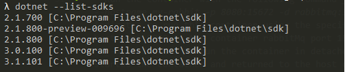
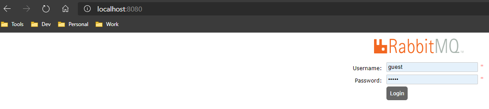
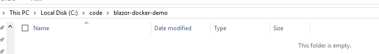
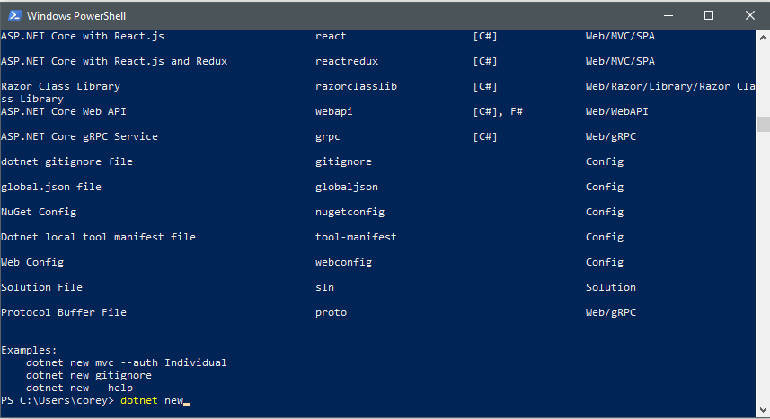
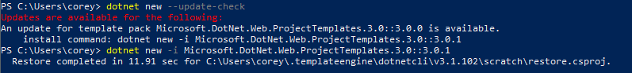

# Docker 7th Birthday Demo (Blazor + RabbitMQ on Docker)
 
## Install Docker

> Windows
* https://docs.docker.com/docker-for-windows/install/

> Linux
* https://docs.docker.com/install/linux/docker-ce/ubuntu/

> Mac
* https://docs.docker.com/docker-for-mac/install/

## Install VS 2019 
> Windows & Mac
* https://visualstudio.microsoft.com/downloads/
> Linux
* Download Visual Studio Code (same link as above)
   - (some extra configuration might be necessarry for a full debugging experience - Google & StackOverflow are your friends)
* Download the .NetCore 3.1.x SDK if it is not included in your VS 2019 install.
  * You can check what .NetCore versions are installed via this command from your command prompt or terminal _dotnet --list-sdks_
   * 

## Install RabbitMq Docker
> More info https://www.rabbitmq.com/

> RabbitMQ is lightweight and easy to deploy on premises and in the cloud. It supports multiple messaging protocols. RabbitMQ can be deployed in distributed and federated configurations to meet high-scale, high-availability requirements.

> We will be using rabbitMq in our demo as a messaging server and client.
* Pull the rabbitMq container that includes management plugin container image
   * Use this command to pull the container _[rabbitmq:3-management](https://hub.docker.com/_/rabbitmq)_ by executing _docker pull rabbitmq:3-management_ 
   * Run the container with the following command _docker run --name my-rabbit --hostname my-rabbit -p 8080:15672 -d rabbitmq:3-management_ which indicates to run this container using the specifed host name and map the host port 8080 to the container rabbitMq port 15672. 
   * _-d_ Indicates to run the container in detached mode which means we started the container and returned to the host command prompt.
   * If you browse to http://localhost:8080 you should see the RabbitMq managment page. The default user name is _guest_ and the password is _guest_.
   * 
   * Congrats you have successfuly deployed the RabbitMq docker container.

## Create Sample App
* Create a folder to store your application and Dockfile with in _ex. C:\code\blazor-doker-demo\)_

* From the command line or terminal run the following commands in the above created folder that will contain your project and Dockerfile _ex. (C:\code\blazor-docker-demo\\)_.
*  You may open PowerShell or any command line terminal _I will be using PowerShell for this tutorial._
* Then execute the command _dotnet new_ to view a list of the installed templates.

* Next execute _dotnet new --update-check_ to check for template updates and run the command it provides if updates are available.

* Scroll through the list to see if you find the template named "blazor". If you don't find the blazor template installed run the following command to install the Blazor templates  _dotnet new -i Microsoft.AspNetCore.Blazor.Templates::*_

## Deploy to docker container

## Test
